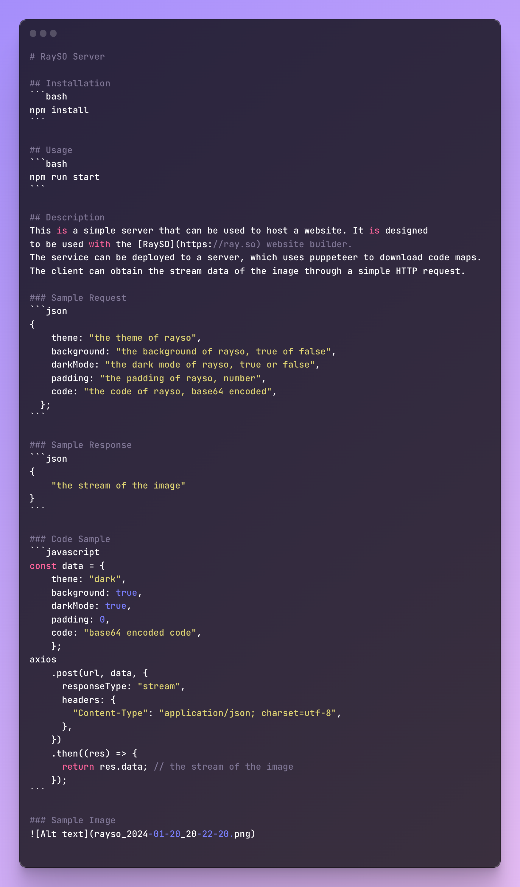

# RaySO Server

## Installation
```bash
npm install
```

## Usage
```bash
npm run start
```

## Description
This is a simple server that can be used to host a website. It is designed
to be used with the [RaySO](https://ray.so) website builder.
The service can be deployed to a server, which uses puppeteer to download code maps. 
The client can obtain the stream data of the image through a simple HTTP request.

### Sample Request
```json
{
    theme: "the theme of rayso",
    background: "the background of rayso, true of false",
    darkMode: "the dark mode of rayso, true or false",
    padding: "the padding of rayso, number",
    code: "the code of rayso, base64 encoded",
}
```

### Sample Response
```json
{
    "the stream of the image"
}
```

### Code Sample
```javascript
const data = {
    theme: "dark",
    background: true,
    darkMode: true,
    padding: 0,
    code: "base64 encoded code",
    };
axios
    .post(url, data, {
      responseType: "stream",
      headers: {
        "Content-Type": "application/json; charset=utf-8",
      },
    })
    .then((res) => {
      return res.data; // the stream of the image
    });
```

### Sample Image
